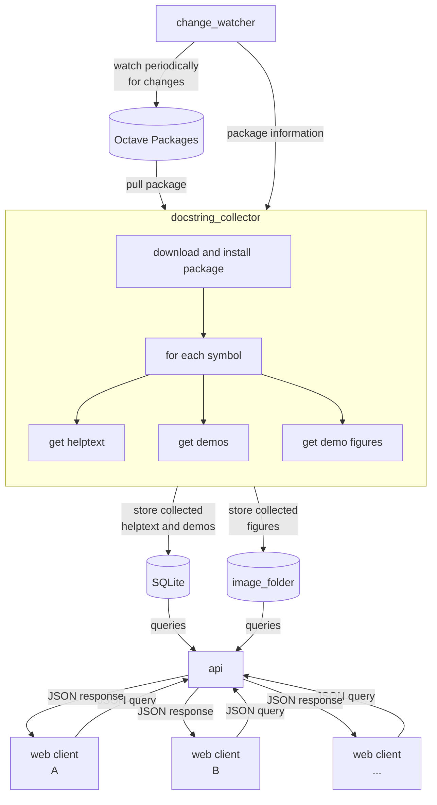

# OctaveReference

A self-contained documentation system for Octave and Octave Packages.

## Documentation generation workflow

> [Flowchart syntax](https://mermaid.js.org/syntax/flowchart.html)

## Database schema

- package
  - id: INTEGER PRIMARY KEY ASC
  - name: TEXT
  - version: TEXT
  - archive_source: TEXT
  - archive_sha256: TEXT
  - created_unix_time: INTEGER

- symbol
  - id: INTEGER PRIMARY KEY ASC
  - FOREIGN KEY(artifact_id) REFERENCES package(id)
  - name: TEXT
  - artifact_relative_path: TEXT
  - doc_h1: TEXT
  - doc: TEXT

- demo
  - id: INTEGER PRIMARY KEY ASC
  - FOREIGN KEY(symbol_id) REFERENCES symbol(id)
  - order: INTEGER
  - code: TEXT

- figure
  - id: INTEGER PRIMARY KEY ASC
  - FOREIGN KEY(demo_id) REFERENCES demo(id)
  - order: INTEGER
  - file_name: TEXT
